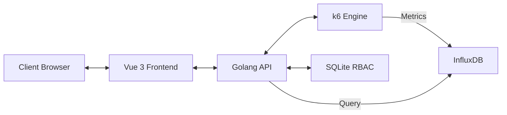

# ⚡ Prahara

**Prahara** (meaning *Storm* or *Tempest* in Indonesian) is a high-performance, lightweight, and secure testing suite designed for modern QA and Load testing. It brings together the power of **k6** and **InfluxDB** with a stunning **Vue 3** dashboard and a robust **Golang** backend.


---

## 🌟 Key Features

- [x] **⚡ Quick Storm**: Instant dynamic load testing for any URL directly from the dashboard.
- [x] **🌐 URL Registry & Categories**: Centralized management for testing endpoints with categories (Frontend, Backend, API, etc.).
- **🚀 High-Performance Engine**: Backend written in **Golang** (Gin) for maximum efficiency and concurrency.
- **📈 Native k6 Integration**: Seamlessly execute k6 scripts and visualize metrics in real-time.
- **🕒 Sustainability & History**: All metrics are stored in **InfluxDB**, allowing you to track performance trends over weeks or months.
- **🔐 Secure RBAC**: Fine-grained access control with Roles (Admin, Tester) powered by JWT and SQLite.
- **📊 Professional Visualization**: Interactive charts for Latency, Throughput, and Success Rates using **Chart.js**.
- **🐳 Zero-Conf Dockerized**: Deploy the entire stack (API, Web, DB) with a single command.

---

## 🏗️ Architecture



---

## 🚀 Getting Started

### Prerequisites

- [Docker](https://www.docker.com/get-started)
- [Docker Compose](https://docs.docker.com/compose/install/)

### Installation

1. **Clone the repository**:
   ```bash
   git clone https://github.com/your-repo/prahara.git
   cd prahara
   ```

2. **Launch the stack**:
   ```bash
   docker-compose up --build
   ```

3. **Access the application**:
   - **Frontend**: `http://localhost`
   - **API**: `http://localhost:3000`
   - **InfluxDB Dashboard**: `http://localhost:8086`

---

## 🤖 CI/CD Setup (GitHub Actions)

To enable automatic Docker Hub publishing, you need to configure the following **Secrets** in your GitHub repository (`Settings > Secrets and variables > Actions`):

1. **`DOCKERHUB_USERNAME`**: Your Docker Hub username.
2. **`DOCKERHUB_TOKEN`**: Your Docker Hub Personal Access Token (PAT).

The workflow will trigger on every push to the `main` branch, building and pushing:
- `yourusername/prahara-api:latest`
- `yourusername/prahara-web:latest`

---

## 📖 Usage Guide

### 1. Authentication
- **Default Username**: `admin`
- **Default Password**: `password`
*Note: You can manage users and roles in the Configuration tab.*

### 2. Creating a Storm (Test)
1. Navigate to the **Test Editor**.
2. Write your k6 script or use a provided template (Get Request, Stress Test, etc.).
3. Click **Launch Storm** to begin the execution.

### 3. Analyzing Results
- Go to the **Dashboard** to see aggregated metrics.
- Monitor **Average Latency**, **Peak Virtual Users (VUs)**, and **HTTP Error Rates**.
- Recent runs are saved in the "Recent Storms" table for historical comparison.

---

## 🛠️ Technology Stack

- **Frontend**: Vue 3, Vite, Tailwind CSS, Lucide Icons, Chart.js.
- **Backend**: Golang (Gin-Gonic), GORM.
- **Testing Engine**: k6 (Grafana).
- **Time-Series DB**: InfluxDB 2.x.
- **Relational DB**: SQLite (for Users & Test Metadata).
- **Orchestration**: Docker Compose.

---

## 🤝 Contributing

Contributions are welcome! Whether it's adding new k6 templates, improving the dashboard visuals, or optimizing the Go services, feel free to submit a PR.

---

## 📄 License

This project is licensed under the MIT License. Built with ⚡ by the Prahara Team.
